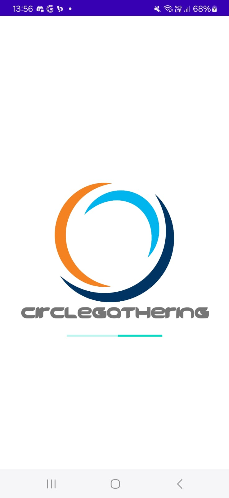
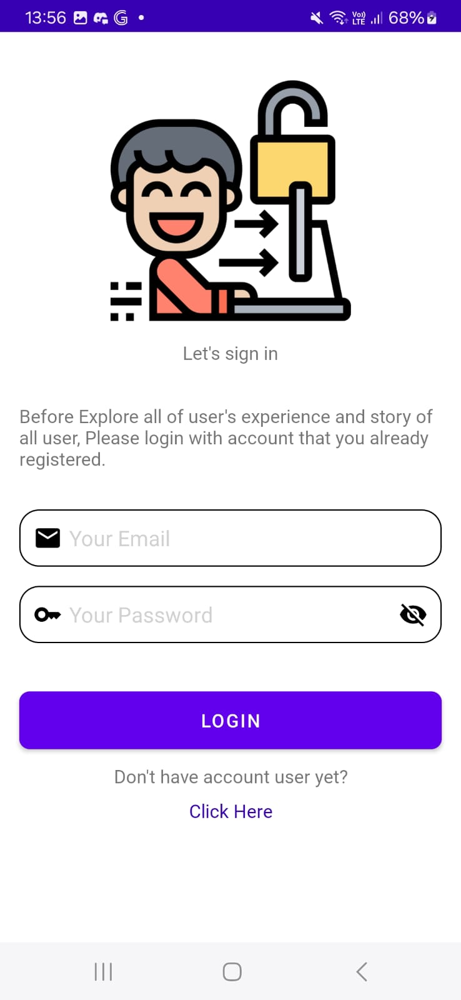
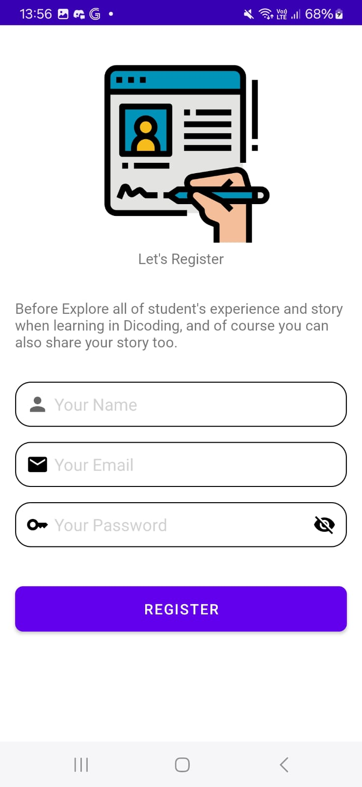
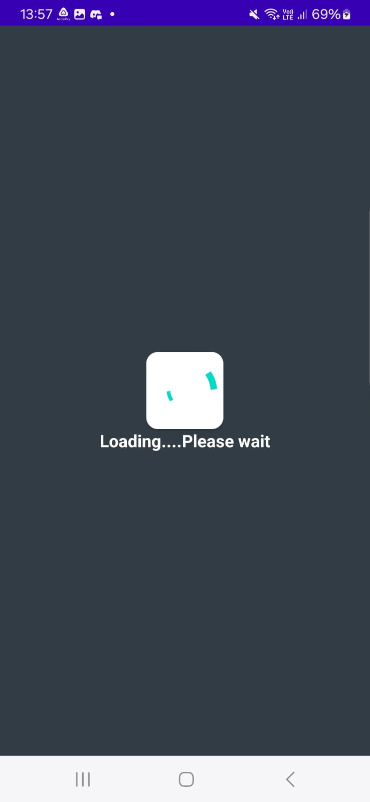
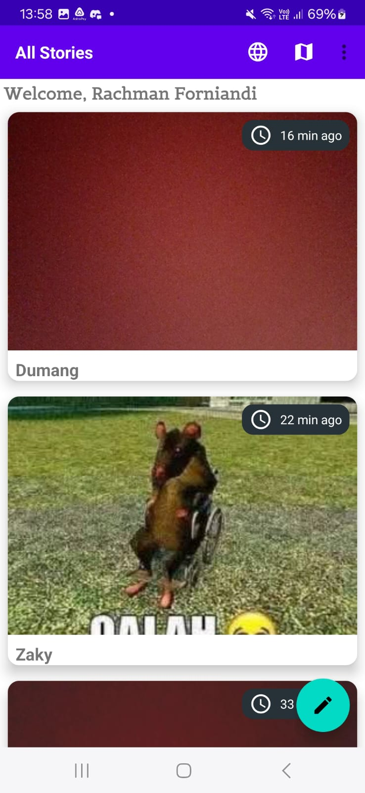
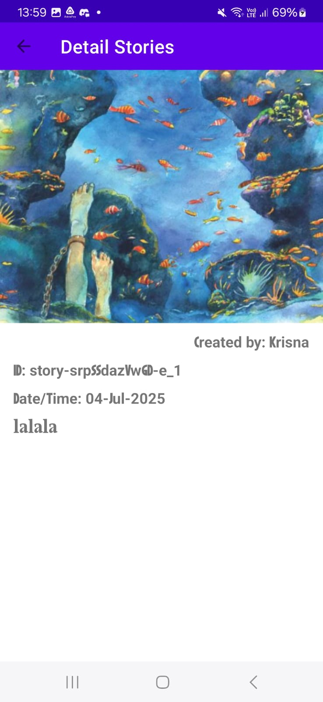
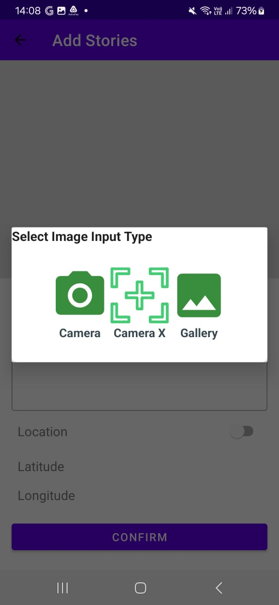
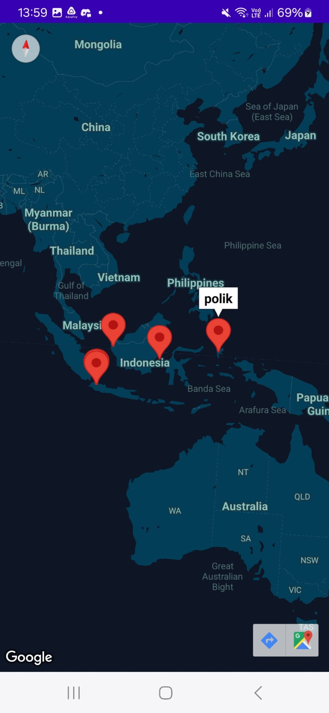
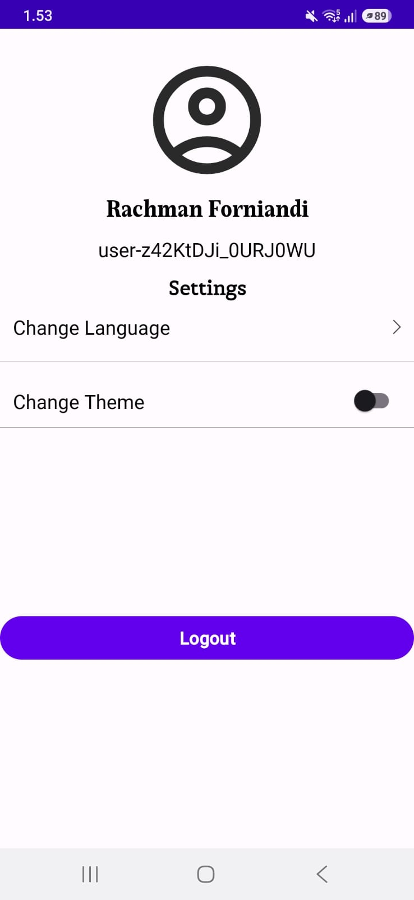

<h1 align="center">🔵 Circle Gathering</h1>

<p align="center">
  An Android application built with Kotlin featuring story sharing, interactive maps, dark mode, localization, and advanced animations.<br>
  Developed as a submission project for <a href="https://www.dicoding.com/academies/352" target="_blank">Dicoding — Belajar Pengembangan Aplikasi Android Intermediate</a>.
</p>

<p align="center">
  
  
  
  
  
</p>

---

## 📋 Table of Contents

- [Features](#-features)
- [Tech Stack](#-tech-stack)
- [Getting Started](#-getting-started)
- [Screenshots](#-screenshots)

---

## ✨ Features

- 🔐 **Authentication** — Secure Login & Register with token-based session management
- 🗺️ **Story Maps** — View stories pinned on an interactive Google Map
- 🌐 **Localization** — Multi-language support (English & Indonesian)
- 🎬 **Advanced Animation** — Smooth transitions and shared element animations
- 🌙 **Dark Mode** — Full dark theme support via DataStore preferences
- 📷 **Camera Integration** — Capture or pick photos using CameraX
- 📄 **Paging 3** — Efficient infinite-scroll story feed
- ⏳ **Shimmer Loading** — Skeleton loading effect for better UX
- 💉 **Dependency Injection** — Powered by Dagger Hilt

---

## 🛠️ Tech Stack

| Category | Library / Tool |
|---|---|
| Language | Kotlin |
| Architecture | MVVM + Repository Pattern |
| DI | Dagger Hilt |
| Networking | Retrofit2 + OkHttp3 |
| Image Loading | Glide / Picasso |
| Local Storage | Room Database |
| Preferences | DataStore |
| Paging | Paging 3 |
| Maps | Google Maps SDK |
| Camera | CameraX |
| UI | ViewBinding, Navigation Component, Material Design |
| Animation | Property Animation, Motion Layout |
| Debug | Chucker |

---

## 🚀 Getting Started

### Prerequisites
- Android Studio Hedgehog or later
- Android device / emulator with API 26+
- Google Maps API Key

### Installation

1. **Clone the repository**
   ```bash
   git clone https://github.com/RachmanForniandi/CircleGathering.git
   ```

2. **Open** the project in Android Studio and **Run** the app

---

## 📸 Screenshots

### 1. Splash Screen
<p align="center">
  
</p>

---

### 2. Login
<p align="center">
  
</p>

---

### 3. Register
<p align="center">
  
</p>

---

### 4. Loading Screen
<p align="center">
  
</p>

---

### 5. Main
<p align="center">
  
</p>

---

### 6. Detail
<p align="center">
  
</p>

---

### 7. Input Data
<p align="center">
  
</p>

---

### 8. Map
<p align="center">
  
</p>

---

### 9. About & Settings
<p align="center">
  
</p>

---

<p align="center">Made with ❤️ by <a href="https://github.com/RachmanForniandi">Rachman Forniandi</a></p>
